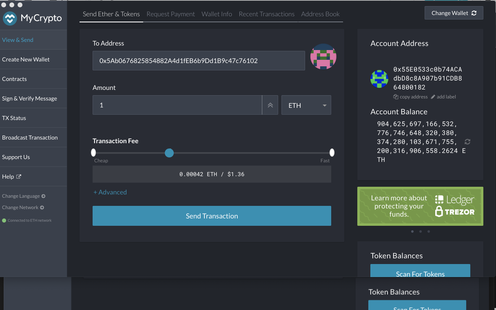

# Created a Proof of Authority Blockchain using Geth


### Summary

* Used the geth commands "./geth --datadir node1 account new" to create 2 new acccounts node1 and node2.
* Generated the Genesis block using Puppeth. We called the Network - chuckpoa and we used Proof of Authority consensus algorith. 
* We sealed the 2 accounts 
* We pre-funded them both. 
* We exported the genesis configurations
* We then initialized the nodes with the genesis json files. 
* We will also get the Keystore files for both nodes
* Then we ran both nodes in 2 separate terminals 
* These steps got the private PoA blockchain running!


Below are some screenshots:

Folder structure showing the Node1 and Node2 and also a new wallet with 0 balance was created.


### Starting Node 1 - 

./geth --datadir node1 --unlock "55E0533c0b74ACAdbD8c8A907b91CDB864800182" --mine --rpc --allow-insecure-unlock


### Starting Node 2 - 

./geth --datadir node2 --unlock "c86f20F59759C7A5B99f0be1b97be0A1906436D5" --mine --port 30304 --bootnodes "enode://165c2740605bcabdc867235640f13df4d975dc9fc388668cf1e726758a7dcc4e4d171666c1a4f14ec722a11fc2f894762bf1f42573894d17fb72bf013274ada8@127.0.0.1:30303" --ipcdisable --allow-insecure-unlock


### Sending transaction


#### MyCrypto

We used MyCrypto as a wallet. 

MyCrypto is an **Ethereum focused web wallet** that allows Ledger users to store their Ethers as well as all ERC20 tokens. An open-source web-based wallet application, MyCrypto lets you manage the plethora of Ethereum-based tokens all while keeping your private keys offline.

A New wallet was created with balance 0. We created it with Keystore method. (see screenshot of  folder structure where we also stored  the newwallet too). We  will use the wallet address of this new wallet to send a  transaction from Node1.


Next we also created a Custom Node with URL http://127.0.0.1:8545 to connect to the private blockchain we were running. 

Using the Keystore file of Node 1 we connected to the Node 1 wallet below which already has funds.


Now send 1 ETH from Node 1 to New wallet created.




Now New wallet has the 1 ETH balance.


3. #### Instructions on how to use the chain for the rest of your team.

- We need to start the 2 nodes from the directory where we created the Blockchain. See screenshots provided before. This will get the Blockchain up and running.

- The folder under Node 1 and node 2 has the keystore files under the nodes Keystore folder. We will need these to be picked with MyCrypro later to  send any transactions from these wallets  to  any otther address. (screenshots from step 2 illustrate that)

  


### Geth

Geth(Go Ethereum) is **a command line interface for running Ethereum node implemented in Go Language**. Using Geth you can join Ethereum network, transfer ether between accounts or even mine ethers. 


Notes to understand concepts and commands:

```
MINER OPTIONS:
  --mine                              Enable mining
```

```
NETWORKING OPTIONS:
  --bootnodes value                   Comma separated enode URLs for P2P discovery bootstrap
```

### Bootnode

[Bootnode](https://github.com/ethereum/go-ethereum/wiki/Setting-up-private-network-or-local-cluster#setup-bootnode) is a lightweight application used for the [Node Discovery Protocol](https://github.com/ethereum/devp2p/blob/master/rlpx.md#node-discovery). Bootnodes do not sync chain data. Using a UDP-based [Kademlia](https://en.wikipedia.org/wiki/Kademlia)-like RPC protocol, Ethereum will connect and interrogate these bootnodes for the location of potential peers. The Ethereum Foundation maintains several bootnodes for the public Ethereum networks; the endpoints of which are [hard-coded in the Geth source code](https://github.com/ethereum/go-ethereum/blob/master/params/bootnodes.go). The default list can be configured using the `--bootnodes` option:

```
geth --bootnodes [enode://pubkey1@ip1:port1,enode://pubkey2@ip2:port2,…]
```


```
API AND CONSOLE OPTIONS:
  --ipcdisable                        Disable the IPC-RPC server
```


```
ACCOUNT OPTIONS:
```

```
 --allow-insecure-unlock             Allow insecure account unlocking when account-related RPCs are exposed by http
```


The ethereum CLI `geth` provides account management via the `account` command:

```
$ geth account <command> [options...] [arguments...]
```

Manage accounts lets you create new accounts, list all existing accounts, import a private key into a new account, migrate to newest key format and change your password.

Keys are stored under `<DATADIR>/keystore`. 

When you install Geth with helper tools, it comes with a handy tool called Puppeth, which you can use to maintain and install various helper tools for managing and deploying your private blockchain.

Reference - https://geth.ethereum.org/docs/interface/managing-your-accounts


### Puppeth network manager

Do you *like* setting up a private network? Don’t answer that! Truth be told, if you’ve ever tried to set up your own private Ethereum network - whether for friendly fun, corporate work, or hackathon aid - you’ll certainly know the pain it takes to do so. Configuring a genesis block is one thing, but when you get to bootnodes, full nodes, miners and light clients, things start to wear thin fast… and we haven’t even talked about monitoring, explorers, faucets, wallets. It’s a mess.

Geth 1.6 ships a new tool called `puppeth`, which aims to solve this particular pain point. **Puppeth is a CLI wizard that aids in creating a new Ethereum network down to the genesis, bootnodes, signers, ethstats, faucet, dashboard and more, without the hassle that it would normally take to configure all these services one by one**. Puppeth uses ssh to dial into remote servers, and builds its network components out of docker containers using docker-compose. The user is guided through the process via a command line wizard that does the heavy lifting and topology configuration automatically behind the scenes.

Puppeth is not a magic bullet. If you have large in-house Ethereum deployments based on your own orchestration tools, it’s always better to use existing infrastructure. However, if you need to create your own Ethereum network without the fuss, Puppeth might actually help you do that… fast. Everything is deployed into containers, so it will not litter your system with weird packages. That said, it’s Puppeth’s first release, so tread with caution and try not to deploy onto critical systems.

Reference - https://blog.ethereum.org/2017/04/14/geth-1-6-puppeth-master/


